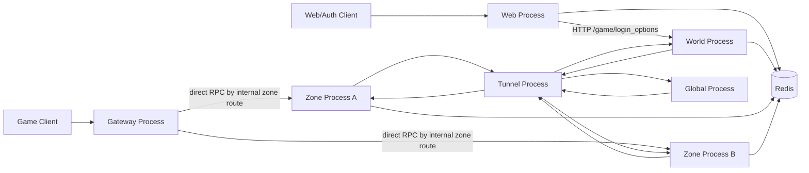
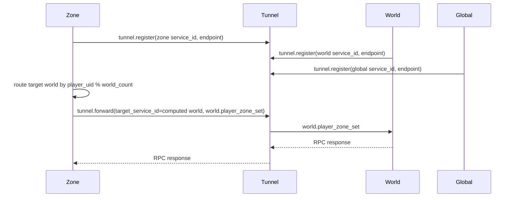
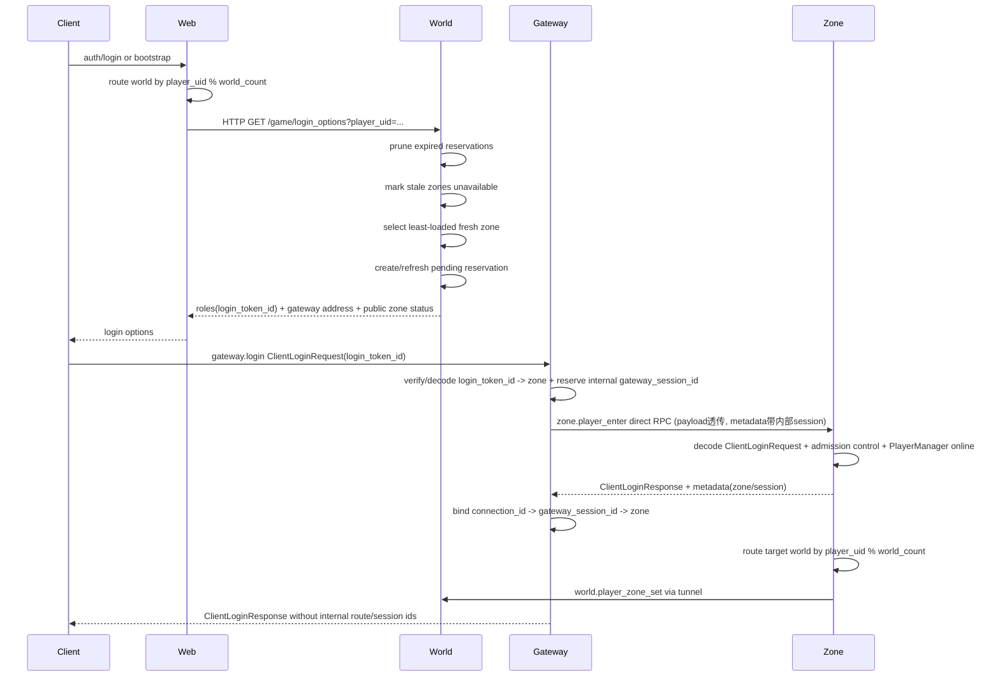
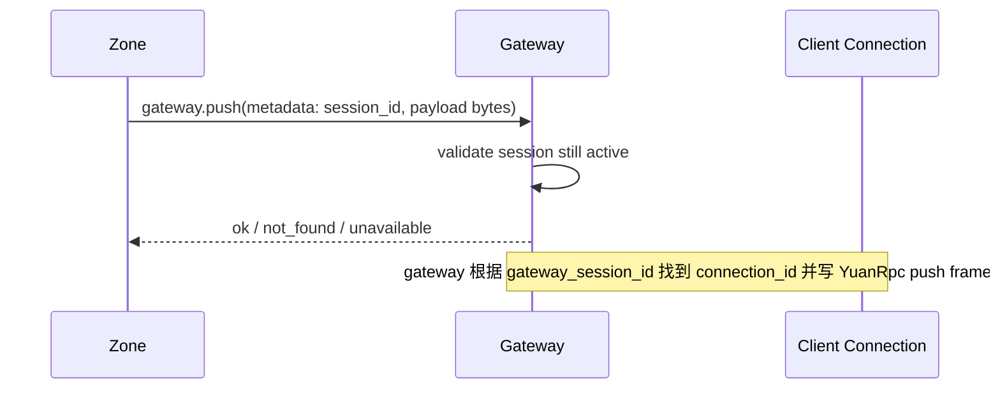

# Game Server 设计说明

本文说明 `libs/game/server` 当前的本地多进程 GameServer 骨架设计、服务边界、消息流、登录与会话模型、容灾策略和测试方式。

这套代码的目标不是把所有游戏逻辑写完，而是提供一个可继续生产化的服务端骨架：每个服务独立进程，公共协议与进程间消息统一，外部客户端只能进入 gateway，内部服务通过 service id 路由。

## 设计目标

- 每个服务一个独立进程，使用 `yuan::app::Application` / `yuan::app::Service` 生命周期。
- 服务启动只读 JSON 配置，不在代码里硬编码 endpoint；正式配置不允许端口 `0` 或缺必要 host。
- `libs/rpc` 保持通用 RPC 协议/抽象库，不依赖 Core 网络实现。
- GameServer 复用 Core 的网络、timer、HTTP、Redis client 等基础能力。
- 外部客户端只连接 gateway，不暴露 tunnel/world/zone/global 内部 RPC 端口。
- world 负责选区、角色轻量状态、zone freshness、登录 reservation 和 ownership fencing。
- gateway 负责客户端连接会话、登录态校验、为客户端包补内部 gateway session 上下文并转发到 zone。
- zone 负责玩家在线运行数据、准入控制、业务执行和定时持久化。
- tunnel 负责内部 service id 注册、发现、转发、广播和异步 reply。
- Redis 是外部进程，GameServer 不内嵌也不启动 Redis。

## 目录结构

```text
libs/game/server/
  common/        公共业务协议、service id、配置解析、RPC 网络适配、可选 CS frame codec
    codec/       协议序列化 backend；当前默认 binary，预留 protobuf/json 类型
    proto/       通用协议/DTO 结构；CS* 为客户端协议，SS* 为服务间/内部协议，其他中性命名用于 HTTP/展示 DTO
  messaging/     通用进程间消息能力，封装 tunnel endpoint、heartbeat、failover
  tunnel/        内部服务注册与 service id 转发基础设施
  global/        全局服务示例，GM 转发/全局功能入口
  world/         选区、角色轻量状态、登录选项、ownership fencing、HTTP login_options
  zone/          玩家运行数据、登录准入、业务执行、数据 flush
  gateway/       外部客户端入口，连接/session 表、直连 zone
  web/           外部 web/auth 方向入口，通过 world 获取游戏登录选项；handler/service/app 分层
  client/        本地 smoke/mock client
  config/        JSON 示例配置，构建时复制到 build 输出目录
  test/          GameServer 对应测试
```

服务内部继续按职责分层：

- `app/`：进程启动、配置、生命周期、网络/Redis/tunnel/http wiring。
- `rpc/`：内部 RPC 接口注册、decode、调用 handler、encode response。
- `handler/`：web 侧 HTTP handler/controller 注册与实现。
- `service/`：web 侧业务服务，例如注册、登录、bootstrap 聚合。
- `model/`：业务对象、缓存、会话表、ownership store 等业务状态。

## 服务拓扑



当前关键边界：

- `gateway` 不连接 world，不连接 tunnel，只根据配置直连 zone。
- `web` 不依赖 GameServiceId/tunnel 这些内部字段，只知道 world HTTP 地址。
- 客户端只看到 gateway 地址、角色基础信息、登录 token 和 zone 展示状态；不会收到或回传 `zone_service_id`、`gateway_session_id`。
- `world/global/zone` 会注册到 tunnel，首次失败不退出，后台重试。
- `zone` 注册/上报给 world 时带自身负载和对外 gateway 地址。
- 一个 gateway 可以服务多个 zone，一个 zone 当前配置约束只对应一个 gateway。

## 进程与职责

| 进程 | 主要职责 | 对外/对内关系 |
| --- | --- | --- |
| `game_tunnel_server` | 服务注册、service id 路由、随机/广播转发、异步 reply | 内部 RPC 基础设施 |
| `game_global_server` | 全局服务与 GM 示例入口 | 注册到 tunnel |
| `game_world_server` | 登录选项、选区、zone freshness、reservation、role ownership fencing、HTTP API | 注册到 tunnel，同时监听 HTTP |
| `game_zone_server` | 玩家在线状态、zone admission、业务执行、定时 flush、上报 world | 注册到 tunnel，连接 Redis |
| `game_gateway_server` | 客户端入口、连接/session 校验、登录态校验、转发到 zone | 对客户端暴露，对 zone direct RPC |
| `game_web_server` | 外部 web/auth 方向入口 | 连接 Redis 和 world HTTP |
| `game_rank_server` | 游戏排行榜和角色简要信息服务，使用 GameServer RPC/binary 协议 | 注册到 tunnel，连接 Redis，供其他业务服拉取 |
| `game_chat_web_server` | 外部聊天 HTTP API、频道订阅、消息、撤回、Redis pub/sub 事件 | 连接 Redis，不经过游戏服 |
| `game_player_db_proxy_server` | 玩家数据持久化代理 | 注册到 tunnel，隔离 zone 对玩家 Redis/MySQL schema 的直接访问 |
| `game_world_db_proxy_server` | world 域轻量数据代理 | 注册到 tunnel，隔离 role location/online/session 等 world read model 存储 |
| `game_global_db_proxy_server` | global 域持久化代理 | 注册到 tunnel，保存全局配置、审计、封禁等跨 world 数据 |
| `game_mock_client` | 本地 smoke 客户端 | 模拟 web/world/gateway/zone 完整路径 |

## Service Id

GameServer 使用 packed service id 做内部路由：

```text
PackedGameServiceId = uint64_t

bits:
  region   12 bits
  world    12 bits
  type     12 bits
  instance 28 bits
```

示例：

```cpp
pack_game_service_id(1, 1, GameServiceType::zone, 2)
```

这个 id 用于：

- tunnel 注册 endpoint。
- tunnel 指定实例转发。
- world/gateway/zone 内部路由和 ownership fencing。
- gateway 根据连接上下文维护 `connection_id -> gateway_session_id -> zone_service_id`。
- zone/world/gateway 做 ownership/session fencing。

## 配置模型

配置文件位于 `libs/game/server/config/*.json`，构建时由 `copy_game_server_configs` 复制到 build 输出目录。

主要配置字段：

- 通用监听：`listen_host`、`port`。
- 服务标识：`region`、`world`、`service_type`、`instance`。
- tunnel endpoint：`tunnel_endpoints`。
- gateway endpoint：`gateway_endpoints`。
- zone endpoint：`zone_endpoints`。
- world 登录 reservation：`login_reservation_ttl_ms`。
- 登录 token 签名密钥：`login_token_secret`，world/gateway 必须配置一致；token 包含过期时间并由 gateway 验签，未配置时使用内置默认值。可用环境变量 `GAME_LOGIN_TOKEN_SECRET` 覆盖。
- gateway 内部路由密钥：`gateway_internal_secret`，用于 `gateway.push` / `gateway.session.close` 等内部 route metadata 校验；可用环境变量 `GAME_GATEWAY_INTERNAL_SECRET` 覆盖。
- world 路由：`world_routing_strategy`、`world_routing_version`、`world_count`。当前生产方案使用 `modulo`，即 `world = 1 + player_uid % world_count`，world 编号固定为 `1..world_count`。
- world zone freshness：`zone_report_ttl_ms`。
- world ownership store：`world_ownership_store`，可选 `memory` 或 `redis`。
- zone 负载同步：`zone_load_sync_interval_ms`。
- zone 准入容量：`zone_max_players`。
- tunnel heartbeat：`tunnel_heartbeat_interval_ms`。
- 周期 metrics 日志：`metrics_log_interval_ms`，`0` 表示关闭。

配置约束：

- 正式配置不接受无效 host 或端口 `0`。
- `global/world/zone` 使用 `tunnel_endpoints` 数组，可配置多个 tunnel。
- `gateway` 使用 `zone_endpoints`，不配置 tunnel/world。
- `zone` 必须配置且只能配置一个 `gateway_endpoints`，用于上报给 world。
- `web` 使用显式 `world_endpoints` 加 world routing 配置选择固定 world HTTP endpoint；`world_count` 是配置分片数，不随某个 world 存活状态变化。
- JSON `world_endpoints` 形态为 `{ "world": 1, "host": "127.0.0.1", "port": 25103, "state": "open" }`；旧 key/value 配置形态为 `world_endpoints=1,127.0.0.1,25103,open;2,127.0.0.1,25104,open`。
- 扩容/缩容 modulo world 必须停服调整 `world_count` 和 `world_routing_version`，不能运行中因为某个 world down 改变取模基数。
- zone 上报负载时携带 routing 配置；world 只接受 `world_routing_strategy`、`world_routing_version`、`world_count` 完全一致的 zone 注册。

## 内部 RPC 与 tunnel 路由

内部 RPC route 使用数字协议，定义在 `common/game_rpc_protocol.h`。字符串 route name 只作为 debug/fallback 信息。

RPC wire 层只承载 `yuan::rpc::Bytes payload`，不绑定具体序列化格式。GameServer 当前默认使用 `common/codec/game_binary_codec.*`，底层 reader/writer 在 `common/codec/binary_codec.h`。未来接 protobuf/json 时应新增 codec backend，而不是修改 `libs/rpc` wire 协议。

协议组织边界：

- `common/proto/*` 放协议结构、通用 DTO 和基础类型；普通协议结构自己实现 `binary_encode(...)` / `binary_decode(...)`。
- `common/codec/*` 放序列化 backend 和通用入口，当前有 `encode_binary(...)` / `decode_binary<T>(...)` 和 `GameCodecType`。
- 简单二进制协议用 `YUAN_GAME_BINARY_FIELDS(...)` 声明 wire 字段，一次生成 `binary_encode(...)` / `binary_decode(...)`，避免每个协议手写重复 codec。
- 游戏客户端边界协议使用 `CS` 前缀，例如 `CSLoginRequest`。
- 服务间/内部协议使用 `SS` 前缀，例如 `SSPlayerZoneUpdate`、`SSGmCommandRequest`。
- gateway 不解客户端 `CS*` payload，也不要求客户端额外传 `ClientFrameHeader`；gateway 只按 `rpc.connection_id` 维护连接/session，并把客户端 payload 透传给 zone。
- gateway 到 zone 的内部路由上下文通过 RPC metadata 传递，例如 `gateway.session_id`；gateway 不处理 `player_uid/role_id` 业务语义，这些由 zone 解客户端 payload 后校验和保存。
- `GatewayMsgContext` 只保存 gateway 状态和配置，不保存 login/game/logout/time 业务 handler；注册 gateway route 时显式注入 zone 选择、zone 转发、client push 三个基础能力。
- `gateway.time_sync` 不在 gateway 修改时间或解请求，只按已登录 session 透传到 `zone.time_sync`，由 zone 生成响应。
- HTTP/展示 DTO 不强行使用 `SS`，例如 `LoginOptionsResponse`。
- route handler 不应假设 RPC wire 是 binary/protobuf/json，只处理解码后的协议对象或显式调用对应 codec。
- 新增普通二进制协议时不需要改 `game_binary_codec.h/.cpp`：在协议结构内用 `YUAN_GAME_BINARY_FIELDS(field1, field2, ...)` 声明 wire 字段，上层统一调用 `encode_binary(obj, bytes)` / `decode_binary<Type>(bytes)`。
- 只有 wire layout 不同或需要兼容多种格式的协议才保留专用 codec 函数。

当前 `YUAN_GAME_BINARY_FIELDS(...)` 是轻量的“本地生成器”：字段顺序就是 wire 顺序，支持基础类型、`std::string`、`yuan::rpc::Bytes`、`std::vector<T>` 和嵌套协议结构。后续如果协议继续增长，可以把同一份字段清单迁移到 `.proto/.yaml/.json` schema，再生成 C++ struct 和相同的 `binary_encode/binary_decode` 方法；上层调用方式不用变。

tunnel 支持三种转发模式：

- `specific`：指定一个具体 service instance。
- `random_one`：在某个 service type 下随机选一个实例。
- `all_of_type`：广播给某个 service type 下所有实例。

内部消息流：



`ProcessMessageManager` 在 `messaging/` 中提供服务侧通用能力：

- 多 tunnel endpoint 管理。
- heartbeat。
- register/forward/send/random/broadcast。
- failover 与 reconnect probe。
- retry attempts/retries/recoveries/failures 计数。

## 登录与选区流程

当前登录分两段：先从 web/world 获取登录选项，再连 gateway 登录。web 用公共 world routing 按 `player_uid` 固定选择 world；world 不连接 gateway；world 选出 zone 后生成带过期时间和签名的 `login_token_id` 给客户端，客户端首包只带 token，不直接暴露 `zone_service_id`。gateway 验签、检查过期时间并还原 token 得到目标 zone，然后在登录成功后把内部 route context 绑定到真实连接。

`login_token_id` 格式为 `zone_service_id.expires_at_ms.mac`，`expires_at_ms` 是 token 本身的一部分并参与 HMAC-SHA256；gateway 拒绝过期、缺失 expiry 或 MAC 不匹配的 token。



选区规则：

- world 不使用 `%` 求余选择 gateway/zone。
- web 和 zone 使用同一份 `common/world_routing.h` 计算玩家归属 world；tunnel 不理解 uid，只按明确的 `target_service_id` 转发。
- world 挂掉时，归属到该 world 的玩家不可用；不能把 down world 从 `world_count` 中删除后重新取模。
- 已登录角色优先保持当前 zone。
- 新登录角色从 fresh、available、未满载的 zone 中选 `online_players + pending_reservations` 最小者。
- 同一个 role 重复请求 login options 会复用并刷新同一 reservation。
- 同一个 player uid 同时只能在线一个 role；world 显式维护 `uid -> online session` 和 `role -> online session`，新 role 上线时会清理同 uid 旧 role 的 ownership/session。
- reservation 到期后会被清理。
- zone 定时上报负载；超过 `zone_report_ttl_ms` 未上报会被标记 unavailable。
- zone 自身还有 admission control，作为最终准入保护。

## Gateway 长连接与会话

gateway 当前对客户端暴露的是 Core TCP 上的 YuanRpc frame stream。也就是说，网络层是长连接 framed RPC：同一 TCP 连接可以连续发送多个 YuanRpc request frame，server 按 frame 完整性解包后再调用 gateway handler。

当前 gateway 收包链路：

```text
TCP bytes
  -> RpcNetworkServer per-connection FrameStreamDecoder
  -> complete YuanRpc request frame
  -> rpc::Server route dispatch
  -> gateway handler
  -> lookup connection context by rpc.connection_id
  -> direct RPC to zone with original payload + internal metadata
```

`RpcNetworkServer` 的关键语义：

- 支持半包：`DecodeError::need_more` 时保留 buffer，等待后续 read。
- 支持粘包：一次 read 中有多个完整 YuanRpc frame 时循环处理。
- 支持同一 TCP 连接多次 request/response，不在每次 response 后主动 close。
- 协议错误会关闭当前连接并清理该 connection 的 decoder state。
- 每个 request 会带内部 metadata `rpc.connection_id` 进入 handler，用于绑定 gateway session 到真实 TCP connection。
- handler 可以返回内部 metadata `rpc.close_connection=1`，adapter 会先写 response 再关闭连接。
- handler 可以返回内部 metadata `rpc.defer_response=1`，adapter 不立即写 response；业务随后调用 `write_response_to_connection()` 写回。gateway 用这个机制把 zone 网络转发放到自己的串行 handler worker，避免网络 runtime 线程等待 zone timeout。
- `RpcNetworkServerConfig` 支持连接生命周期控制：`max_connections`、`max_buffered_bytes`、`idle_timeout_ms`。
- `close_all_connections()` 用于 drain 时主动关闭当前 active connections。
- `active_connection_count()` 提供结构化 metrics accessor。
- `stop_after_requests` 只用于测试里让 server run loop 退出，不代表生产连接生命周期。
- handler 默认在网络 runtime 线程串行执行。不要在 `RpcNetworkServer` 内部为每个请求创建线程，也不要隐式引入 worker pool；GameServer 上层状态默认按单线程模型编写。
- 如果某个业务确实需要阻塞或耗时任务，应由该业务显式投递到自己的后台队列/线程池，或使用 `rpc.defer_response` 后续写回，并为相关状态加同步保护。

当前 smoke/mock client 已验证同一个 gateway TCP 连接上连续完成 login、game、time sync、logout。gateway 客户端入口不会在网络 runtime 线程等待 zone 网络 timeout；内部 world/zone/tunnel 的后台或非客户端入口路径仍可继续使用短连接 `RpcNetworkClient::call(...)`。

如果后续要接“非 YuanRpc 包裹”的 raw CS socket，已有 `ClientFrameStreamDecoder` 可以直接复用在 socket read callback 上，实现 CS frame 自身的半包/粘包处理。

客户端到 gateway 的正式 CS 包使用 YuanRpc route + 业务 payload。当前 gateway 客户端入口不要求额外的 `ClientFrameHeader`。客户端 payload 是业务协议 bytes，gateway 不解；gateway 只使用 `RpcNetworkServer` 注入的 `rpc.connection_id` 找连接上下文。

登录时 gateway 只从 `CSLoginRequest` 读取 `login_token_id` 并验签还原目标 zone，然后为连接 reserve 一个内部 `gateway_session_id`，把原始 login payload 和 metadata 转发给 zone。zone 解 `CSLoginRequest` 后把 `zone_service_id/gateway_session_id` 通过 response metadata 回给 gateway，gateway 再绑定：

session table 当前保存：

```text
gateway_session_id -> zone_service_id / connection_id
connection_id -> gateway_session_id
```

`connection_id` 由 `RpcNetworkServer` 注入。gateway login 成功时会记录：`gateway_session_id -> connection_id`。连接关闭后，gateway 会在后台 cleanup 线程中：

- 找到该 connection 上的所有 session。
- 向对应 zone 发送 logout。
- 清理本地 session table。

## Gateway Push 骨架

当前已经有 `gateway.push` 内部 RPC route，用于承接 zone -> gateway -> client 的异步推送路径。push 目标通过 metadata 指定，payload 原样写给客户端连接，gateway 不解具体 push 协议。



当前行为：

- `gateway.push` 从 metadata 读取 `gateway.session_id`，不解 push payload。
- gateway 校验 `gateway_session_id` 是否仍是当前连接 session。
- `GatewayServerService` 默认 push 能力会把 payload 原样写成 YuanRpc `push` frame 给该 session 对应的 TCP connection。
- 如果 session 不存在、role 不匹配或 connection 已断开，返回 `RpcStatus::unavailable`。

## Zone 玩家模型与持久化

zone 是玩家运行态数据的 owner。

当前模型：

- `Player`：单个玩家/角色运行对象。
- `PlayerManager`：玩家缓存、在线集合、dirty 状态、flush。
- `online_roles_`：真实在线角色集合。
- `players_by_role_`：角色数据 cache。

关键规则：

- 登录成功后角色进入 online 集合。
- 登出时移除 online，并标 dirty。
- `online_count()` 基于 online 集合，不基于 cache 数量。
- 玩家对象数据序列化为 JSON 后保存。
- 保存失败必须 `LOG_ERROR`。
- Redis 是外部服务进程，zone 只连接使用。

## World Ownership Fencing

world 只保存给 web/选区用的轻量状态，不保存玩家完整运行数据。

role ownership 需要抵抗以下乱序：

- 玩家从 zone A 切到 zone B 后，zone A 的迟到 logout 不能清掉 zone B ownership。
- 同一 zone 内旧 session 的迟到 logout 不能清掉新 session ownership。

当前接口：

```cpp
world_set_player_zone(context,
                      role_id,
                      zone_service_id,
                      source_zone_service_id,
                      gateway_session_id);
```

fencing 逻辑：

- logout 时，如果 source zone 不是当前 zone，则忽略。
- logout 时，如果 gateway session 不是当前 session，则忽略。
- 同 uid 切换 role 后，旧 role 的迟到 logout 不能清掉 `online_by_uid` 里的当前新 role session。
- login/update 时记录最新 zone/session。

`world/model/world_ownership_store.*` 提供可插拔 store：

- `InMemoryWorldOwnershipStore`：单进程/测试使用。
- `RedisWorldOwnershipStore`：使用 Redis Lua CAS 语义，避免多 world 或 world 重启后 fencing 信息只存在内存里。

`game_world_server` 通过 `world_ownership_store` 配置选择 store：

- `memory`：默认模式，适合本地和单 world 测试。
- `redis`：使用 Redis Lua CAS，适合多 world 或 world 重启后仍要保留 fencing 的场景。

如果直接构造 `WorldMsgContext` 且未设置 `ownership_store`，仍会使用 context 内部 map 行为。

## 容灾与恢复

### Tunnel 注册重试

`global/world/zone` 注册 tunnel 时不因首次失败退出，而是后台循环：

- 成功后周期刷新注册。
- 失败后短间隔重试并记录错误。
- tunnel service 对同 service id 的重复注册做覆盖更新。

### Tunnel endpoint failover

`ProcessMessageManager::call_tunnel(...)` 会：

- 优先尝试 alive tunnel。
- 没有 alive 或需要 probe 时也会尝试 dead tunnel。
- 当前 endpoint 无响应或返回 `RpcStatus::unavailable` 时尝试下一个。
- 记录 attempts/retries/recoveries/failures。
- 在重试之间做小的 bounded backoff。

### Gateway 到 Zone 重试

gateway direct RPC 到 zone 时：

- 同一 endpoint 最多尝试 3 次。
- 无响应或 `unavailable` 会重试。
- 恢复成功会记录 recovered 日志。
- 记录 attempts/retries/recoveries/failures。

### Zone freshness 与 admission

world 的 zone 选择只是前置优化，不能保证绝对容量正确。最终准入在 zone：

- world 根据 zone 定时负载和 pending reservation 选区。
- zone 根据真实 `online_count()` 和 `zone_max_players` 做 admission。
- zone 满载时返回 `RpcStatus::unavailable`。

### Metrics 日志

`ProcessMessageManager` 和 `GatewayServerService` 都维护基础 counters：

- attempts
- retries
- recoveries
- failures
- active gateway connections
- active gateway sessions

`metrics_log_interval_ms` 控制进程是否周期输出 metrics 日志：

- `0`：关闭周期日志，只在 stop 时输出 summary。
- `>0`：按配置间隔输出 world tunnel metrics 或 gateway zone metrics。

当前是日志可见性和结构化 accessor，不是 Prometheus exporter。后续如果接 metrics 系统，可以直接复用已有 counters/accessors。

### Graceful Drain 基础状态

当前已实现 gateway/world drain 基础状态：

- gateway stop 时进入 draining。
- world stop 时进入 draining。
- gateway draining 后拒绝新 login/game/push。
- gateway stop 会先等待已入队 handler、按 session 向 zone 发送 logout flush、等待 gateway->zone pending/queued request 清空，再调用 `RpcNetworkServer::close_all_connections()` 主动关闭 active client connections。
- `gateway_drain_timeout_ms` 控制 gateway drain 总等待上限，默认 3000ms。
- world draining 后 HTTP `/game/login_options` 返回 service unavailable。

RPC 语义上，request 必须返回 response；push/notification 不要求业务回包。当前 gateway push 已做到写入 TCP 输出缓冲并 flush，不能证明客户端业务已处理。如果要强语义 push ack，需要定义客户端 ACK route，并在 gateway/zone/world 维护 ack pending、超时和重试策略。

## 外部 HTTP API

web 是完整独立的外部 HTTP 服务，不注册 GameServer RPC route，不连接 tunnel，也不需要内部 `GameServiceId`。它只根据配置连接 Redis 和 world HTTP。

web 对客户端提供：

```text
GET  /bootstrap?player_uid=<uid>
POST /register
POST /login
```

`POST /register` 和 `POST /login` 请求体：

```json
{ "account": "alice", "password": "pw" }
```

成功返回账号结果和登录选项：

```json
{
  "ok": true,
  "player_uid": 42,
  "message": "login ok",
  "gateways": [],
  "roles": [],
  "zones": []
}
```

web 登录/注册成功后，通过 HTTP 请求 world 获取游戏登录选项。

rank 是游戏域服务，承载各种榜单和角色简要信息；它独立成进程，注册到 tunnel，数据放 Redis，其他业务服通过 GameServer RPC/binary 协议拉取：

```text
rank.role.update   SSRankRoleUpdateRequest  -> SSRankRoleResponse
rank.role.get      SSRankRoleGetRequest     -> SSRankRoleResponse
rank.score.update  SSRankScoreUpdateRequest -> SSRankScoreResponse
rank.score.remove  SSRankScoreRemoveRequest -> SSRankScoreResponse
rank.score.get     SSRankScoreGetRequest    -> SSRankScoreResponse
rank.top.get       SSRankTopGetRequest      -> SSRankTopResponse
```

榜单 member 建议使用 `role:<role_id>`；`rank.top.get` 和 `rank.score.get` 会在返回中附带已保存的角色简要信息。

player db proxy 是玩家强持久化数据的领域代理。zone 保留玩家运行态 cache，但 load/save/flush 优先通过 `player_db_proxy`，未配置时才回退旧 Redis key。proxy 支持多实例部署，业务服通过 `player_db_proxies` group 按 owner id 路由；`target_player_db_proxy_instance` 只作为旧式 fallback。当前第一阶段接口：

```text
player_db.load_role  SSPlayerDbLoadRoleRequest -> SSPlayerDbRoleResponse
player_db.save_role  SSPlayerDbSaveRoleRequest -> SSPlayerDbRoleResponse
```

当前 Redis key 仅在 proxy 内部使用：`game:player_db:player_role:<role_id>`。后续接 MySQL 或分库分表时，应继续保持 zone 只调用领域 RPC，不暴露库表/key 规则。

world db proxy 是 world 域轻量持久化代理。world 通过 `world_db_proxies` group 选择 proxy；role location 持久化不在登录链路同步等待，而是进入 world dirty flush/retry 队列，避免嵌套 tunnel RPC 阻塞登录。当前第一阶段接口：

```text
world_db.role_location.get  SSWorldDbRoleLocationGetRequest -> SSWorldDbRoleLocationResponse
world_db.role_location.set  SSWorldDbRoleLocationSetRequest -> SSWorldDbRoleLocationResponse
```

当前 Redis key 仅在 proxy 内部使用：`game:world_db:role_location:<role_id>`。该服务只保存 role location / online session 这类 world read model，不保存玩家完整对象。

global db proxy 是 global 域持久化代理。初始领域用于全局配置项，后续可扩展 GM audit、封禁状态、全局 ID、配置版本等跨 world 数据：

```text
global_db.config.get  SSGlobalDbConfigGetRequest -> SSGlobalDbConfigResponse
global_db.config.set  SSGlobalDbConfigSetRequest -> SSGlobalDbConfigResponse
```

当前 Redis key 仅在 proxy 内部使用：`game:global_db:config:<key>`。

db proxy group 配置形态统一，例如：

```json
{
  "player_db_proxies": {
    "strategy": "modulo",
    "version": 1,
    "shard_count": 2,
    "endpoints": [
      { "service_id": 4504702360223745, "shard": 0, "state": "open" },
      { "service_id": 4504702360223746, "shard": 1, "state": "open" }
    ]
  }
}
```

`select_db_proxy(owner_id, routing)` 当前支持 `modulo`。`version` 和 `shard_count` 是配置一致性边界；扩缩容应按停服/迁移计划调整，不应让业务代码散写 modulo。

db proxy 共享一套 ORM-style 本地 API，放在 `common/storage`，提供 `query/insert/update/delete_/batch` 和 Redis-backed `RedisOrmStore`。这套 API 给 proxy 内部复用；业务服仍优先调用领域 RPC，例如 `player_db.save_role`、`world_db.role_location.set`、`global_db.config.set`，不要直接把 SQL/Redis 命令透传给业务服。

在 ORM 之上还有 entity 层：`EntityRecord{table,key,fields,version}` 和 `EntityStore::load/save/remove/save_batch`。新增领域数据时先定义 table/key/fields/version 映射，再在 proxy handler 内调用 entity store；避免每个新结构重复写 Redis key 拼接、JSON 编解码和版本字段处理。

chat web 是独立外部 HTTP 服务，不经过游戏服；频道订阅状态、消息存储和频道事件都在 Redis。当前 HTTP API 提供 durable subscription 和消息历史，实时推送侧可直接订阅 Redis channel `game:chat:pubsub:<channel>`，后续也可以在该进程接 WebSocket/SSE：

```text
POST /chat/subscribe    {"channel":"world","user_id":"90001"}
POST /chat/unsubscribe  {"channel":"world","user_id":"90001"}
POST /chat/publish      {"channel":"custom","user_id":"90001","text":"hello","message_type":"text"}
POST /chat/world/publish   {"user_id":"90001","text":"hello"}
POST /chat/group/publish   {"group_id":"100","user_id":"90001","text":"hello"}
POST /chat/private/publish {"from_user_id":"90001","to_user_id":"90002","text":"hello"}
POST /chat/recall       {"channel":"world","message_id":"1"}
GET  /chat/messages?channel=world&limit=50
GET  /chat/world/messages?limit=50
GET  /chat/group/messages?group_id=100&limit=50
GET  /chat/private/messages?user_id=90001&peer_user_id=90002&limit=50
POST /chat/friend/add    {"user_id":"90001","friend_user_id":"90002"}
POST /chat/friend/remove {"user_id":"90001","friend_user_id":"90002"}
GET  /chat/friend/list?user_id=90001
```

chat web 内部分层：`app` 只负责 HTTP server 生命周期和依赖注入；`handler` 只做 HTTP/JSON 适配；`service` 负责会话类型、消息类型、好友关系、Redis 存储和 pub/sub 推送事件。当前会话类型包括通用 channel、世界、群聊、私聊；消息类型先支持 `text/image/voice/system/custom`。

world 监听 HTTP，给外部 web 使用：

```text
GET /game/login_options?player_uid=<uid>
```

成功返回 JSON：

```json
{
  "ok": true,
  "gateways": [
    { "host": "127.0.0.1", "port": 30001, "name": "gateway-a" }
  ],
  "roles": [
    { "role_id": 10001, "name": "knight", "level": 12 }
  ],
  "zones": [
    { "name": "zone-a", "online_players": 12, "max_players": 1000, "available": true }
  ]
}
```

错误返回：

```json
{ "ok": false, "error": "..." }
```

HTTP 解析、参数、路由、body 读取复用 `HttpProto` API。

## 数据所有权

```text
Redis
  account/auth data
  role summary or ownership fencing when configured
  persisted player JSON from zone

World
  role summary for login options
  current role -> zone/session fence
  zone load/freshness/reservation state

Zone
  authoritative online player runtime data
  dirty player cache
  flush to Redis on timer/stop

Gateway
  client session table
  gateway_session_id -> role/zone/connection route
```

原则：

- 玩家运行数据属于 zone。
- world 不承载完整玩家对象。
- gateway 不承载玩家业务状态，只承载连接和 session route。
- tunnel 不理解业务，只做内部路由基础设施。

## 测试覆盖

主要测试在 `libs/game/server/test/`：

- `test_game_server_login_flow.cpp`
  - gateway 内部 session id 分配。
  - invalid connection context 拒绝。
  - 裸客户端 payload 通过 gateway 按 connection context 转发到 zone。
  - zone 登录后把 `gateway_session_id` 绑定到 role，用于后续 push/cleanup。
  - `gateway.push` 对 active session 成功。
  - reservation 分散 burst login。
  - duplicate login options 复用同 role reservation。
  - reservation TTL prune。
  - stale zone TTL。
  - ownership/session fencing。

- `test_game_server_tunnel.cpp`
  - service id route。
  - random_one。
  - all_of_type broadcast。
  - async reply。
  - tunnel endpoint retry。
  - retry/recovery metrics。
  - down tunnel endpoint 恢复后 reconnect。

- `test_game_server_smoke.cpp`
  - 启动 tunnel/global/world/zone/gateway/mock client 多进程 smoke。
  - 使用 JSON 模板动态改端口。
  - 覆盖 web/world login options、gateway login、GM、game forward、time sync、logout。
  - mock client 使用同一个 gateway TCP 连接连续发送 login/game/time/logout，覆盖 gateway 长连接 RPC frame stream。

- `test_game_server_network_smoke.cpp`
  - Core RPC persistent connection 上连续 request/response。
  - `active_connection_count()` 连接跟踪。
  - `close_all_connections()` drain 主动关闭连接。

- `test_game_server_client_frame.cpp`
  - CS frame encode/decode roundtrip。
  - bad magic 拒绝。
  - sequence pass/replay reject/next sequence pass。
  - oversized payload 拒绝。
  - CS stream decoder 半包、粘包、bad magic/version、oversized payload。

- `test_game_server_world_ownership.cpp`
  - in-memory ownership store zone/session fencing。
  - `WorldMsgContext` 接入 ownership store 后忽略 stale logout。

- `test_game_server_redis_ownership.cpp`
  - Redis ownership store Lua CAS fencing。
  - Redis 不可用时自跳过。

常用验证命令：

```bash
cmake --build build --target game_global_server game_zone_server game_world_server game_gateway_server game_mock_client test_game_server_smoke test_game_server_login_flow test_game_server_tunnel test_game_server_client_frame test_game_server_world_ownership test_game_server_redis_ownership
ctest --test-dir build -R "game_server_redis_ownership|game_server_client_frame|game_server_world_ownership|game_server_login_flow|game_server_tunnel|game_server_smoke" --output-on-failure -V
```

本地真实服务启动脚本：

```bash
libs/game/server/scripts/start_all.sh
libs/game/server/scripts/stop_all.sh
```

脚本默认使用 `build/bin` 和 `build/libs/game/server/config`，pid/log 写到 `build/game_server_run`；可用 `BUILD_DIR` 或 `RUN_DIR` 环境变量覆盖。

## 当前已知边界

当前实现已经具备本地多进程骨架、gateway 持久 TCP/YuanRpc 收包路径、gateway->zone 持久连接复用和 request_id response demux、connection-id session 绑定、push 写回连接、断线 cleanup、连接数/缓冲/idle 控制、zone call pending 队列上限和 drain 关闭连接基础能力，但还不是完整商业长连接网关。需要继续补齐的方向：

- gateway 连接生命周期细化：认证前超时、慢客户端分级处理、按 IP/账号维度限额。
- gateway push 写入的背压处理、失败重试/丢弃策略和客户端 push ack。
- 断线 cleanup 的重试与补偿：zone/world logout 失败时的可靠队列或延迟重试。
- 客户端协议 fuzz 测试、rate limit、replay window 策略、packet-size 策略细化。
- Prometheus exporter。
- 更完整 graceful shutdown/drain：跨服务 pending request 可观测等待、超时关闭、flush session、push ack/flush。
- 多 world 部署下的 Redis ownership store 长时间运行测试。
- 更完整的 Redis role/account/player schema。

这些边界不是设计缺陷，而是下一阶段生产化工作的明确接缝。
